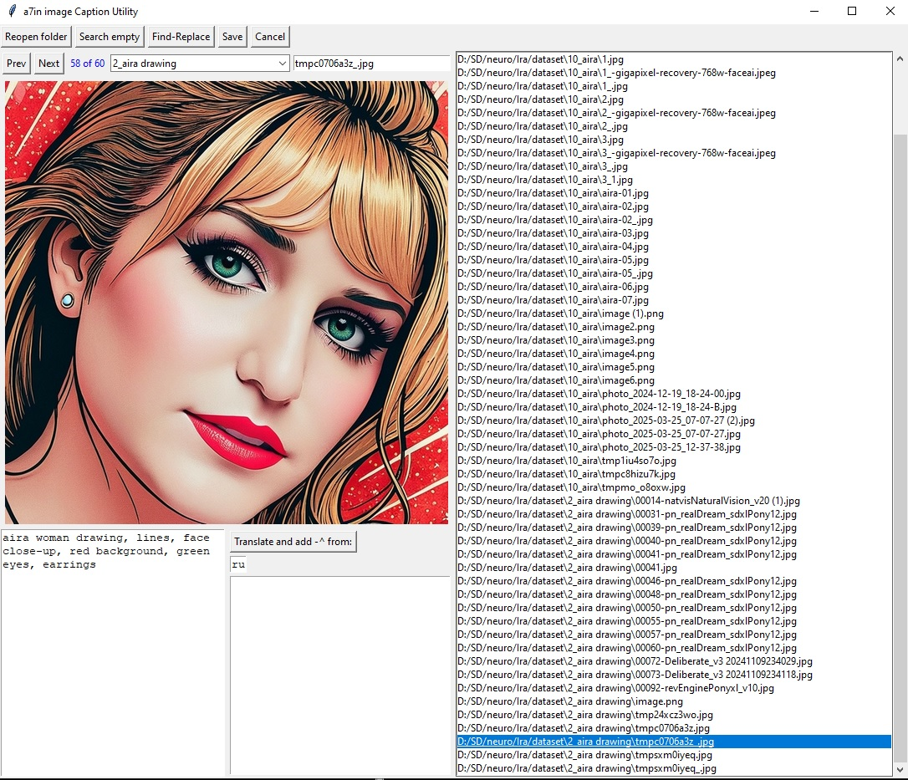

## Utility for viewing and editing text descriptions of images.



## Features:
- Built-in translator to EN (google).
- Automatic saving and creation captions with .txt file extension.
- Search for unsigned images.
- Find and replace text in all files.
- Rename filenames.
- Moving image+caption between directories.

## Install:
1. Clone the repository or download the source code.
2. Navigate to the project directory.
3. install the required libraries using the following command:
  ```bash
  pip install -r requirements.txt
  ```

## Usage:
1. Run the script:
  ```bash
  python main.py
  ```
2. Specify the directory with images.

Captions are saved automatically when changing the current image.

## License:
This project is licensed under the MIT License. See the LICENSE file for details.
