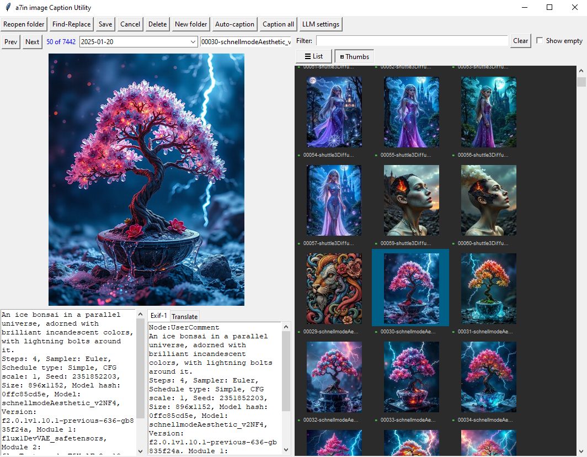

## Utility for viewing and editing text descriptions of images.



## Features:
- Built-in translator to EN (google).
- Automatic saving and creation captions with .txt file extension.
- Search for unsigned images.
- Find and replace text in all files.
- Rename filenames.
- Moving image+caption between directories.
- Delete image+caption.
- Filter image list by substring in captions.
- List and thumbnail view modes with keyboard navigation.
- Thumbnail cache stored in SQLite (auto-generated, invalidated on file changes).
- Working with large directories (10 000 images).
- Drag and drop current image to another program.
- Auto-detection of new images added to the open folder (watchdog-based, no restart needed).
- Create subfolders inside the current folder via the "New folder" button.
- EXIF tab showing prompt/caption text embedded in the image (Automatic1111, ComfyUI).
- AI auto-captioning via an external LLM (OpenAI-compatible endpoint, e.g. llama-server):
  - "Auto-caption" generates a description for the current image; the result is kept even if you navigate away.
  - "Caption all" batch-generates captions for every image without one, with progress shown in the thumbnail progress bar and a Stop option.
  - "LLM settings" configures the connection (base URL, API key, model auto-detect, prompts, etc.); settings are stored in `auto_caption_settings.ini` in the program folder.

## Install:
1. Clone the repository or download the source code.
2. Navigate to the project directory.
3. Install the required libraries using the following command:
  ```bash
  pip install -r requirements.txt
  ```

## Usage:
1. Run the script:
  ```bash
  python main.py
  ```
2. Specify the directory with images.

Captions are saved automatically when changing the current image.

### AI auto-captioning:
1. You need an OpenAI-compatible LLM endpoint with vision support — either a remote API or a local server (e.g. `llama-server` from llama.cpp, LM Studio, Ollama).
   - Example local launch: `llama-server.exe -m <vision-model>.gguf --mmproj <mmproj>.gguf -c 16384 --port 8080 --temp 0.2 --top-p 0.9`
2. Click **LLM settings**, set the base URL (e.g. `http://127.0.0.1:8080/v1`) and, for a remote API, the API key. Use **Test connection** to verify and to auto-detect the model (leave the model field blank to pick it automatically). Settings are stored in `auto_caption_settings.ini` in the program folder.
3. **Auto-caption** generates a description for the current image; the result is kept even if you switch images while it runs.
4. **Caption all** generates captions for every image without one, showing progress (click again to stop).

## License:
This project is licensed under the MIT License. See the LICENSE file for details.
